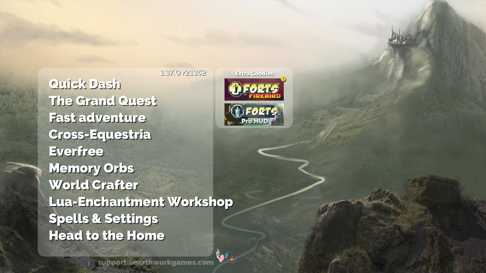

# Forts Ponified
this is the pony-themed forts retexture and language adjustments

## What it has
- Two language packages, fully redone (English, Russian)
- Assets retexture
- Background retexture

## How to install
1. Download files from this github page
2. Go to the root folder of the Forts(it will look like '\Program Files (x86)\Steam\steamapps\common\Forts', but exact path depends on your system and how steam is installed!)
3. Grab the 'data' folder from this project(ignore README.md, license file and images-for-github folder) and overwrite Forts's 'data' folder with the folder you have downloaded from this page.
4. After that, the installation is complete and you can launch the game

Important note: if there's no Equestria background in your game, then you have to switch the background settings ingame. Change background to the 'base' one.

It all started from retexturing background. After that I decided to change language files, and finally some assets. This is not a full conversion of course, but still I feel like it's worth to share this thing to my fellow bronies and just people who will come across this page.
